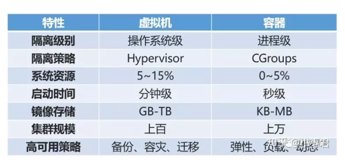

### 一. 描述Docker的网络模式以及区别，使用场景？
docker一共有五种网络模式
   
 1. bridge网络模式  
   桥接模式，默认的网络驱动模式。如果不指定驱动程序，bridge 便会作为默认的网络驱动模式。
   当应用程序运行在需要通信的独立容器 (standalone containers) 中时，通常会选择 bridge 模式。
   docker进程启动时会创建一个docker0网桥，容器内的数据通过这个网卡设备与宿主机进行数据传输。
   docker会为容器创建独有的网络命名空间，也会为这个命名空间配置好虚拟网卡，路由，DNS，IP地址等。
 
   适用于多个容器在相同的docker主机上进行通信。
 2. host模式  
   host模式是容器与Docker主机共享同一网络命名空间，没有隔离。好处：由于容器跟宿主机都在同一网络视图下，可以直接使用宿主机的IP与外界进行通信；
   网络流量通过宿主机的网卡，性能会比较高。 适用于用于网络性能较高的场景，但安全隔离性相对差一些。

   适用于docker主机与宿主机使用相同的网络，但容器其他方面是隔离的，比如文件系统等。
 3. none 网络模式  
    对于此容器，禁用所有联网。通常与自定义网络驱动程序一起使用。none 模式不适用于集群服务。
   Docker容器拥有自己的Network Namespace，但是，并不为 Docker容器进行任何网络配置。
   也就是说，这个 Docker 容器没有网卡、IP、路由等信息。需要我们自己为 Docker 容器添加网卡、配置IP 等。

    适用于不需要互相通信的docker容器。
 4. macvlan模式  
    Macvlan网络允许为容器分配 MAC 地址，使其显示为网络上的物理设备。 Docker 守护进程通过其 MAC 地址将流量路由到容器。
    对于希望直连到物理网络的传统应用程序而言，使用 macvlan 模式一般是最佳选择，而不应该通过 Docker 宿主机的网络进行路由。
    适用于直接连到物理网络的传统应用程序。

    适用于从VM设置迁移或需要您的容器看起来像网络上的物理主机时，每个容器都具有唯一的MAC地址。
 5. overlay模式  
    overlay 网络将多个 Docker 守护进程连接在一起，并使集群服务能够相互通信。您还可以使用 overlay 网络来实现 swarm 集群和独立容器之间的通信，
    或者不同 Docker 守护进程上的两个独立容器之间的通信。该策略实现了在这些容器之间进行操作系统级别路由的需求。   

    适用于不同docker主机上的容器进行通信，或者当多个应用程序使用集群服务一起工作时。

### 二、简要描述AUFS文件系统的特点以及优缺点，如何解决性能问题，如何实现数据持久化（如数据库重启后数据不丢失）
容器运行的文件系统是镜像层和容器层组成的，一层一层叠加，只有最上面的那层是可写的，其他层都是只读的。

AUFS是一种联合文件系统，联合文件系统是一种分层、轻量级并且高性能的文件系统，它支持对文件系统的修改作为一次提交来一层层的叠加，
同时可以将不同目录挂载到同一个虚拟文件系统下。Docker 目前支持的联合文件系统包括 OverlayFS, AUFS, Btrfs, VFS, ZFS 和 Device Mapper。
aufs存储驱动程序以前是用于管理Docker for Ubuntu上的映像和层的默认存储驱动程序.

关于 AUFS 的几个特点：
- AUFS 是一种联合文件系统，它把若干目录按照顺序和权限 mount 为一个目录并呈现出来
- 默认情况下，只有第一层（第一个目录）是可写的，其余层是只读的。
- 增加文件：默认情况下，新增的文件都会被放在最上面的可写层中。
- 删除文件：因为底下各层都是只读的，当需要删除这些层中的文件时，AUFS 使用 whiteout 机制，它的实现是通过在上层的可写的目录下建立对应的whiteout隐藏文件来实现的。
- 修改文件：AUFS 利用其 CoW （copy-on-write）特性来修改只读层中的文件。AUFS 工作在文件层面，因此，只要有对只读层中的文件做修改，不管修改数据的量的多少，在第一次修改时，文件都会被拷贝到可写层然后再被修改。
- 节省空间：AUFS 的 CoW 特性能够允许在多个容器之间共享分层，从而减少物理空间占用。
- 查找文件：AUFS 的查找性能在层数非常多时会出现下降，层数越多，查找性能越低，因此，在制作 Docker 镜像时要注意层数不要太多。
- 性能：AUFS 的 CoW 特性在写入大型文件时第一次会出现延迟。

按照Docker最佳实践的要求，容器不应该向其存储层内写入任何数据，容器存储层要保持无状态化。所有的文件写入操作，都应该使用数据卷(Volume)、
或者绑定宿主目录，在这些位置的读写会跳过容器存储层，直接对宿主(或网络存储)发生读写，其性能和稳定性更高。

有些容器会自动产生一些数据，比如数据库容器，数据表会产生一些数据，如果删除container，数据就会丢失。为了不让数据随着container的消失而消失，保证数据的持久性，
引入了Volume的存在。

两种持久化存储方式：
(1)卷
是宿主机器的文件系统的一部分,Docker推荐使用卷进行持久化数据,卷可支持卷驱动(volume drivers)，该驱动允许用户将数据存储到远程主机或云服务商(cloud provider)或其它。
A.卷可以在容器之间共享和重用；
B.对卷的修改会立马生效；
C.对卷的更新，不会影响镜像；
D.卷默认会一直存在，即使容器被删除。

(2)挂载宿主目录
通过将宿主机器的路径挂载到容器里的这种方式，从而数据持久化，因此绑定挂载可将数据存储在宿主机器的文件系统的任何地方。
非Docker程序可修改这些文件。

作业中的数据持久化：在compose文件中，通过VOLUME指定容器某一个目录的数据挂载到宿主机的一个目录里。

### 三、简要描述Docker和虚拟机的对比
容器和虚拟机，它们都提供了隔离环境。
1.虚拟机是操作系统级别的资源隔离，而容器本质上是进程级的资源隔离。

    
