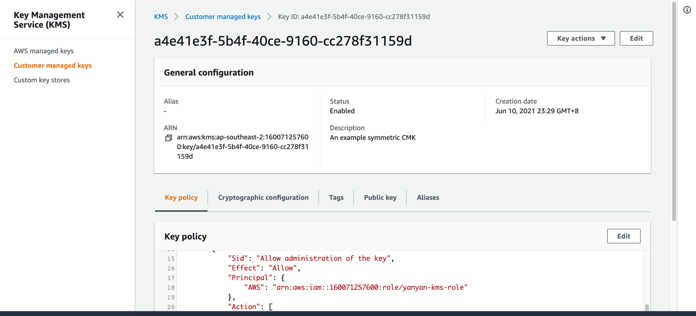

KMS
## Basic
注意⚠️⚠️⚠️：尽量使用一个 KMS 进行练习

AC:
回答下列问题
### KMS 是什么服务？能解决什么问题？
KMS 是方便创建和管理CMKs的服务，是用来加密数据的加密密钥。
AWS KMS 是一项托管式服务，让您能够轻松地创建和控制用于加密操作的密钥。该服务为您提供可用性高的密钥生成、存储、管理和审计解决方案，
让您可以在自己的应用程序内加密您的数据或以数字方式对数据签名，并在 AWS 服务之间对数据的加密进行控制。
解决数据如何加密的问题，使用KMS来集中管理加密密钥以控制对数据的访问。

### 使用 KMS key 的方式有哪些？
- KMS 加密API key
- KMS 加密client id
- KMS 加密一些敏感信息，比如数据连接的username和password.  

### 可以对 KMS key 进行哪些操作？（至少 5 个）
- 创建密钥
- 查看密钥
- 编辑密钥
- 标记密钥
- 启用和禁用密钥
- 下载公有密钥
- 使用别名 

### 使用 CLI 进行练习
### 创建对称加密的 KMS key
命令  
```
aws kms create-key --profile tw-aws-beach --region ap-southeast-2
```


### 加密一段字符串
参考：https://docs.aws.amazon.com/cli/latest/reference/kms/encrypt.html
```
aws kms encrypt --key-id 489c36e5-77c2-4b51-8816-657aec468144 --plaintext fileb://<(cat data) --output text --query CiphertextBlob --region=ap-southeast-2 --profile=tw-aws-beach
```

### 使用同一个 Key 重新加密同一段字符串，观察结果  
结果不同，原因？

### 将加密后的字符串进行解密
参考： https://docs.aws.amazon.com/cli/latest/reference/kms/decrypt.html  
```
aws kms decrypt --ciphertext-blob fileb://<(echo -e 'AQICAHi3MkKnM0wma8F0ve+19hdBeic0HL99jLB15YgXrpK5FgGel3qk20306MoMfdF737eAAAAAiDCBhQYJKoZIhvcNAQcGoHgwdgIBADBxBgkqhkiG9w0BBwEwHgYJYIZIAWUDBAEuMBEEDDYmdUb0MWGkE/+LVwIBEIBETtVIULHW0esAOlHU2UPB0JcVCnOzRpA/tsZL2w89C7SuKn63/XM5kVTn2BqXmsJz37kRclUhfpDiq6stMk1curSrwJU=
' | base64 -D) --key-id 489c36e5-77c2-4b51-8816-657aec468144 --region ap-southeast-2 --profile tw-aws-beach --output text --query Plaintext | base64 --decode
```

Advanced
注意⚠️⚠️⚠️：尽量使用一个 KMS 进行练习

AC:
练习
### 使用 CloudFormation 创建 KMS RSA_4096 的 key
参考： https://docs.aws.amazon.com/zh_cn/AWSCloudFormation/latest/UserGuide/aws-resource-kms-key.html  
It also allows the AWS account (root) full access to the key. 


### 加密并解密一段字符串
```
aws kms encrypt --key-id 489c36e5-77c2-4b51-8816-657aec468144 --plaintext fileb://<(cat data) --output text --query CiphertextBlob --region=ap-southeast-2 --profile=tw-aws-beach
```
```
aws kms decrypt --ciphertext-blob fileb://<(echo -e 'AQICAHi3MkKnM0wma8F0ve+19hdBeic0HL99jLB15YgXrpK5FgGel3qk20306MoMfdF737eAAAAAiDCBhQYJKoZIhvcNAQcGoHgwdgIBADBxBgkqhkiG9w0BBwEwHgYJYIZIAWUDBAEuMBEEDDYmdUb0MWGkE/+LVwIBEIBETtVIULHW0esAOlHU2UPB0JcVCnOzRpA/tsZL2w89C7SuKn63/XM5kVTn2BqXmsJz37kRclUhfpDiq6stMk1curSrwJU=
' | base64 -D) --key-id 489c36e5-77c2-4b51-8816-657aec468144 --region ap-southeast-2 --profile tw-aws-beach --output text --query Plaintext | base64 --decode
```
### 将 KMS Key 与其他服务一同使用（Basic 里的对称加密 Key），如1.加密 S3 文件, 2.加密 parameter store 里的值
参考： https://aws.amazon.com/cn/premiumsupport/knowledge-center/s3-encrypt-specific-folder/
```
 aws s3 cp s3://yanyan-bucket-source/kms-test/ s3://yanyan-bucket-source/kms-test/ --recursive --sse aws:kms --sse-kms-key-id 489c36e5-77c2-4b51-8816-657aec468144 --region=ap-southeast-2 --profile=tw-aws-beach
```
```
aws ssm get-parameter --name param1 --region=ap-southeast-2 --profile=tw-aws-beach
```

### 回答下列问题
### 如何进行 Key rotation？
1.启用和禁用密钥轮换
```
aws kms enable-key-rotation --key-id 489c36e5-77c2-4b51-8816-657aec468144
aws kms get-key-rotation-status --key-id 489c36e5-77c2-4b51-8816-657aec468144

aws kms disable-key-rotation --key-id 489c36e5-77c2-4b51-8816-657aec468144
aws kms get-key-rotation-status --key-id 489c36e5-77c2-4b51-8816-657aec468144
```
2.手动轮换密钥  
如果您希望控制轮换的频率，建议您通过手动的方式轮换密钥。
对于不符合自动密钥轮换要求的 CMK，例如非对称 CMK、自定义密钥存储中的 CMK 以及具有导入的密钥材料的 CMK，这也是一种很好的解决方案。
### AWS 如何进行自动 Key rotation？
参考：https://docs.aws.amazon.com/zh_cn/kms/latest/developerguide/rotate-keys.html  
AWS KMS 中的密钥轮换属于加密最佳实践，特点是透明且易于使用。AWS KMS 仅支持可选的自动密钥轮换客户托管 CMK。

- 备用密钥的管理。  
AWS KMS 会保留 CMK 的所有备用密钥，即使密钥轮换处于禁用状态。只有删除 CMK 后才会删除备用密钥。如果使用 CMK 进行加密，AWS KMS 会使用当前的备用密钥。如果使用 CMK 进行解密，AWS KMS 会使用加密时所用的备用密钥。

- 启用和禁用密钥轮换。  
默认情况下，客户管理的 CMK 的自动密钥轮换处于禁用状态。当您启用 (或重新启用) 密钥轮换时，AWS KMS 会在启用日期 365 天后自动轮换 CMK，并在今后每隔 365 天轮换一次。

- 已禁用的 CMK。  
禁用 CMK 后，AWS KMS 不会对它进行轮换。但是，密钥轮换状态不会发生改变，并且在 CMK 处于禁用状态时不能对其进行更改。重新启用 CMK 后，如果备用密钥已超过 365 天，AWS KMS 会立即轮换，并在此后每隔 365 天轮换一次。如果备用密钥少于 365 天，AWS KMS 会恢复原始密钥轮换计划。

- 待删除的 CMK。 
对于待删除的 CMK，AWS KMS 不会对它进行轮换。密钥轮换状态设为 false，处于待删除状态时不能更改。如果删除被取消，将恢复之前的密钥轮换状态。如果备用密钥已超过 365 天，AWS KMS 会立即轮换，并在此后每隔 365 天轮换一次。如果备用密钥少于 365 天，AWS KMS 会恢复原始密钥轮换计划。

- AWS 托管 CMK。 
对于AWS 托管 CMK。AWS KMS 会每隔三年（1095 天）自动轮换一次 AWS 托管 CMK。

- AWS 拥有的 CMK。 
对于 AWS 拥有的 CMK，您无法管理其密钥轮换。这些区域有：密钥轮换策略由创建和管理 CMK 的 AWS 服务决定。有关详细信息，请参阅静态加密主题或服务的开发人员指南。

- AWS 服务。
您可以在客户托管 CMKAWS 服务中的服务器端加密。年度轮换是透明的，并与 AWS 服务兼容。

- 监控密钥轮换。 
当 AWS KMS 自动轮换AWS 托管 CMK或者客户托管 CMK，它会写一个KMS CMK Rotation事件到Amazon CloudWatch Events和密钥交替添加到您的 AWS CloudTrail 日志中。您可以使用这些记录验证 CMK 是否已轮换。
### 自动 Key rotation 之后收费有什么变化？
对于您在 AWS Key Management Service (KMS) 中创建的每个客户主密钥 (CMK)，
无论您是通过服务、自定义密钥存储库生成潜在密钥材料，还是导入密钥材料，在删除前每月都要花费 1 USD。
对于使用该服务生成的密钥材料的 CMK，如果您选择让其每年自动轮换，则每个新的密钥版本都会使 CMK 的每月成本提高 1 USD。
### Reference
Kick Off 录屏：https://drive.google.com/file/d/1W7YvwUBsxtGmIcA5xCxubErMQh8UpMRV/view?usp=sharing
https://docs.aws.amazon.com/kms/latest/developerguide/overview.html
https://docs.aws.amazon.com/crypto/latest/userguide/awscryp-choose-kms.html
https://awscli.amazonaws.com/v2/documentation/api/latest/reference/kms/index.html
https://docs.aws.amazon.com/kms/latest/developerguide/getting-started.html
https://docs.aws.amazon.com/kms/latest/developerguide/rotate-keys.html
https://aws.amazon.com/kms/pricing/
https://docs.aws.amazon.com/kms/latest/developerguide/symm-asymm-choose.html


