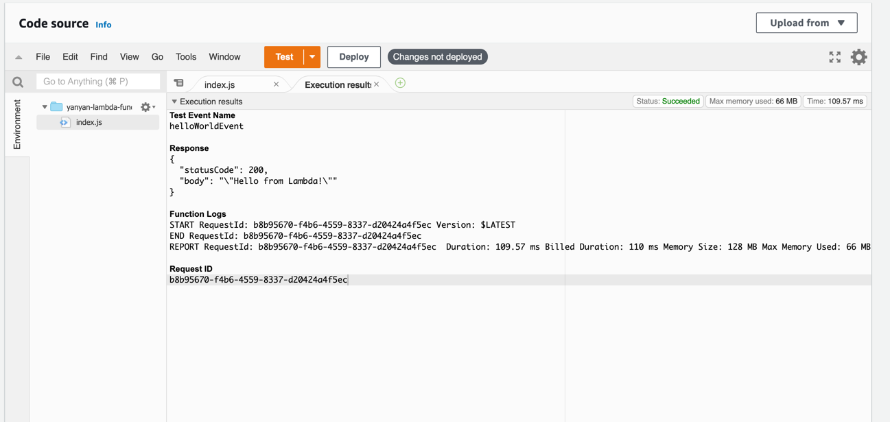

## Basic  
### What is serverless?  
在不考虑服务器的情况下构建并运行应用程序。在serverless出现之前，想要开发应用程序并将其部署在服务器上的时候，
无论是选择公有云还是私有的数据中心，都需要提前了解究竟需要多少台服务器、多大容量的存储和数据库的功能等。
并需要部署运行应用程序和依赖的软件到基础设施之上。
定义： 无服务器架构是基于互联网的系统，其中应用开发不使用常规的服务进程。相反，它们仅依赖于第三方服务
（例如AWS Lambda服务），客户端逻辑和服务托管远程过程调用的组合。
目的：开发人员关注代码的运行而不需要管理任何的基础设施。

### Create lambda function with AWS Web Console and test
什么是lambda?
AWS Lambda 是一项无服务器计算服务，可运行代码来响应事件并为您自动管理底层计算资源。


execution results


### Lambda function via aws cli with ZIP file and invoke Create lambda
参考：
https://docs.aws.amazon.com/lambda/latest/dg/gettingstarted-awscli.html
```
aws iam create-role --role-name yanyan-lambda-ex --assume-role-policy-document '{"Version": "2021-05-26","Statement": [{ "Effect": "Allow", "Principal": {"Service": "lambda.amazonaws.com"}, "Action": "sts:AssumeRole"}]}'
```
1.使用the AWS Command Line Interface，需要access keys
```
Login: saml2aws login --profile tw-aws-beach
Test: aws sts get-caller-identity --profile tw-aws-beach
```
2.创建IAM role的时候，报`Unable to locate credentials. You can configure credentials by running "aws configure".`  
- 没有指定profile，是因为所有的aws命令都要指定profile。
下面是命令
- 创建IAM role  
```
aws iam create-role --role-name lambda-ex-yanyan --assume-role-policy-document file:///Users/yyhuang/Documents/aws-training-directory/aws-training/src/Lamda/trust-policy.json  --profile tw-aws-beach
```

- To add permissions to the role, use the attach-policy-to-role command. Start by 
  adding the AWSLambdaBasicExecutionRole managed policy.  
```
aws lambda create-function --function-name yanyan-function \
--zip-file fileb:///Users/yyhuang/Documents/aws-training-directory/aws-training/src/Lamda/function.zip --handler index.handler --runtime nodejs12.x \
--role arn:aws:iam::160071257600:role/lambda-ex-yanyan --profile tw-aws-beach
```
- Create a deployment package
```
zip function.zip index.js
```
- Create a Lambda function with the create-function command
```
aws lambda create-function --function-name yanyan-function \
--zip-file fileb:///Users/yyhuang/Documents/aws-training-directory/aws-training/src/Lamda/function.zip --handler index.handler --runtime nodejs12.x \
--role arn:aws:iam::160071257600:role/lambda-ex-yanyan --profile tw-aws-beach --region ap-southeast-2
```

created function by AWS-CLI command

- To get logs for an invocation from the command line
```
aws lambda invoke --function-name yanyan-function out --log-type Tail --profile tw-aws-beach --region ap-southeast-2
```  

- You can use the base64 utility to decode the logs.
问题：解码失败。
```
aws lambda invoke --function-name yanyan-function out --log-type Tail --profile tw-aws-beach --region ap-southeast-2 \
--query 'LogResult' --output text |  base64 -d 
```
- List the Lambda functions in your account
```
aws lambda list-functions --max-items 10 --profile tw-aws-beach --region ap-southeast-2
```
- delete the my-function function
```
aws lambda delete-function --function-name my-function
```
### Create lambda by aws cloudformation
参考：https://docs.aws.amazon.com/zh_cn/AWSCloudFormation/latest/UserGuide/Welcome.html
1.创建function,需要deployment package 和 execution role，可执行的role会给function权限去使用
AWS服务。  
2.deployment package可以是一个.zip文件或者image
3.cloudformation模板包含六个顶级部分：AWSTemplateFormatVersion、Description、Parameters、Mappings、Resources 和 Outputs；
但只有 Resources 部分是必需的。
4.验证cloudformation模板有没有错误
```
aws cloudformation validate-template --template-body file:///Users/yyhuang/Documents/aws-training-directory/aws-training/src/Lamda/lamda-function.yml --profile tw-aws-beach --region ap-southeast-2
```
runtime版本不对。


### Log lambda request event to cloudwatch
两种方式：
一、To add permissions to the role, use the attach-policy-to-role command. Start by adding the AWSLambdaBasicExecutionRole managed policy.
```
aws iam attach-role-policy --role-name lambda-ex-yanyan --policy-arn arn:aws:iam::aws:policy/service-role/AWSLambdaBasicExecutionRole
```
The AWSLambdaBasicExecutionRole policy has the permissions that the function needs to write logs to CloudWatch Logs.
二、将现有的 IAM 托管策略添加到新的 IAM 角色
要将现有或新的 IAM 托管策略添加到新的 IAM 角色资源，请使用资源类型 AWS::IAM::Role 的 `ManagedPolicyArns` 属性。


## Advanced
### Cloudwatch events trigger lambda regularly
1.https://docs.aws.amazon.com/AmazonCloudWatch/latest/events/RunLambdaSchedule.html


### Copy file from a s3 bucket to another s3 bucket
参考：1.https://aws.amazon.com/cn/premiumsupport/knowledge-center/s3-troubleshoot-copy-between-buckets/
2.https://www.powerupcloud.com/copying-objects-using-aws-lambda-based-on-s3-events-part-1/
- event
```
{
  "Records": [
    {
      "eventVersion": "2.0",
      "eventSource": "aws:s3",
      "awsRegion": "us-west-2",
      "eventTime": "1970-01-01T00:00:00.000Z",
      "eventName": "ObjectCreated:Put",
      "userIdentity": {
        "principalId": "EXAMPLE"
      },
      "requestParameters": {
        "sourceIPAddress": "127.0.0.1"
      },
      "responseElements": {
        "x-amz-request-id": "EXAMPLE123456789",
        "x-amz-id-2": "EXAMPLE123/5678abcdefghijklambdaisawesome/mnopqrstuvwxyzABCDEFGH"
      },
      "s3": {
        "s3SchemaVersion": "1.0",
        "configurationId": "testConfigRule",
        "bucket": {
          "name": "yanyan-bucket-source",
          "ownerIdentity": {
            "principalId": "EXAMPLE"
          },
          "arn": "arn:aws:s3:::yanyan-bucket-source"
        },
        "object": {
          "key": "identityDocument.pdf"
        }
      }
    }
  ]
}
```
- IAM attach policy
policy 可以再具体一点

- copy success log from lambda

- result

### Trigger Cloudwatch alarm when Lambda failed.
- configure sns topic

- create alarm

- lambda error

  

## Proficient
### Create an api backend using lambda and AWS API gateway (it may need route53)
### AWS lambda can consume event from SNS
- yanyan-s3-copy-lambda-topic 
  
  
### AWS lambda invoke another one
   
### Put your lambda into VPC

培训总结
1.lambda 1,000 个并发执行限制


